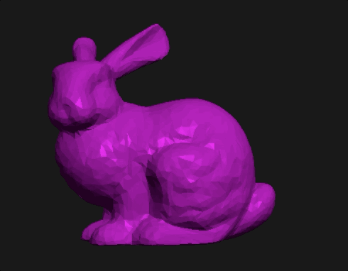
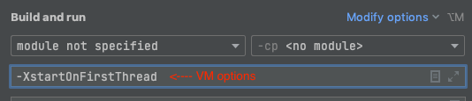
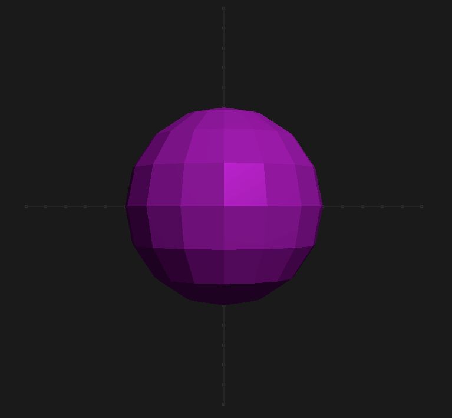
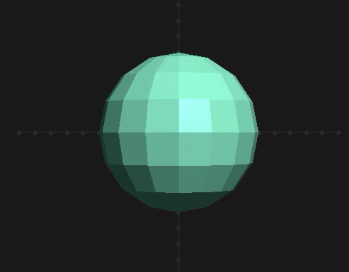
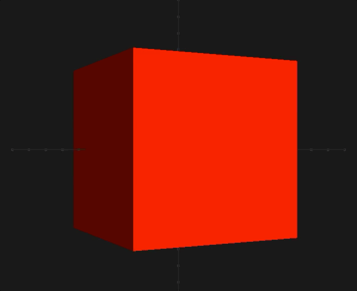
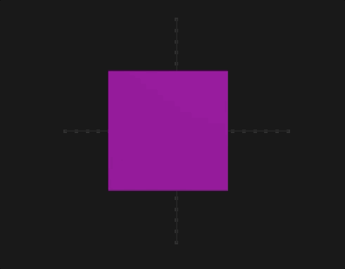
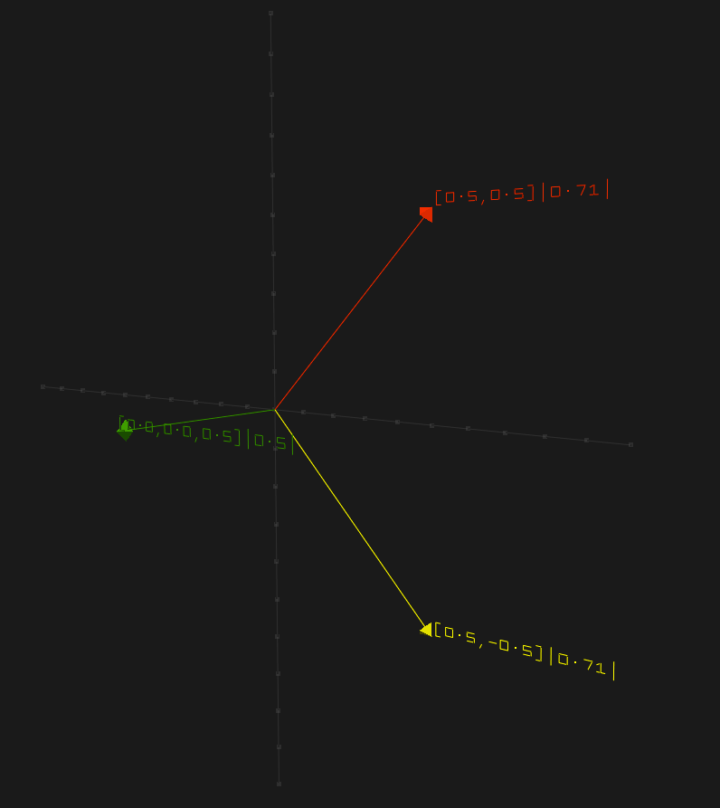
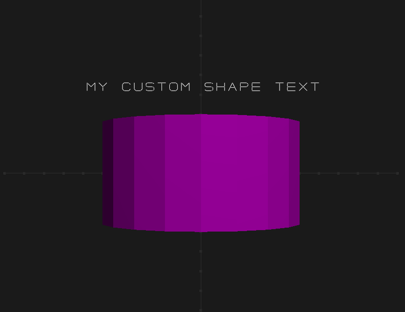

# Slack3D [![Maven central][maven-badge]][maven-link]

[gitter-badge]: https://badges.gitter.im/Join%20Chat.svg

[gitter-link]: https://gitter.im/Slack3D/community

[maven-badge]: https://img.shields.io/maven-central/v/com.github.simerplaha/slack3d_2.13.svg

[maven-link]: https://search.maven.org/search?q=g:com.github.simerplaha%20AND%20a:slack3d_2.13

Simple 3D graphics engine.



# Features

- Phong lighting
- Fly style camera - Freely move around a 3D scene
- Text rendering - English characters and numbers.
- Out of the box Shapes - Vector, Box, Circle, Cone, Cylinder, HeightField, Plane, Point, Pyramid, Sphere, Tetrahedron,
  Triangle, Line & Ray
- OpenGL via LWJGL3
- User input to transform and rotate shapes.
- Basic linear algebra library - `Matrix3`, `Matrix2`, `Vector3` & `Vector2`
- Immutable API

## Key controls

- Space - Pauses current animation
- Enter - Return to initial camera view
- W, A, S, D - Move along the 3D axis
- Mouse drag - Changes camera view position

## Setup

```scala
libraryDependencies += "com.github.simerplaha" %% "slack3d" % "0.1.0"
```

## LWJGL VM Option

**VM Option**: Allow LWJGL to run on main thread with `-XstartOnFirstThread`. If you are using IntelliJ set the flag in
the "Build and run" window.



## Rendering

Slack3D can be thought of a collection instance where your code provide shapes to render for each frame.

Render a sphere of radius `0.5` of colour `Purple`.

```scala
Slack3D("A sphere") foreach {
  state => //State of current render
    //shapes to render
    Seq(Sphere(radius = 0.5, colour = Colour.Purple))
}
```



## Interval rendering

Render shapes after some time interval. The following will render a `Sphere` of radius `0.5` with a new colour after
every 1.second.

```scala
Slack3D("Colour").foreach(interval = 1.second) {
  _ =>
    Seq(Sphere(0.5, colour = Colour.next()))
}
```



All OpenGL colours can be found class type [Colour](/graphics/src/main/scala/slack3d/graphics/colour/Colour.scala). To
get the next colour from a randomly sorted colour queue use```Colour.next()```

## Rotation

Apply Y axis rotation to the box.

```scala
Slack3D("Rotating Box") foreach {
  state =>
    //same code as above but with added rotation at Y axis
    val box = Box(Colour.Red).rotateY(state.getTime() * 30)
    Seq(box)
}
```



Rotation can be applied to all axis. See APIs


## Rotation with user inputs

Configures the `Box` to be

- **translatable** when `Z` key is pressed and arrows keys are moved
- **rotatable** when `X` key is pressed and arrows keys are moved

```scala
Slack3D("Custom rotation").foldLeft(Box()) {
  case (_box, state) =>
    val box =
      _box
        .translatable(state.window, GLFW.GLFW_KEY_Z) //translate box when Z key is pressed
        .rotatable(state.window, GLFW.GLFW_KEY_X) //rotate box when X key is pressed

    (box, Seq(box))
}
```



## Lines/Vectors

Create 2 vectors where the third vector is a cross product.

```scala
Slack3D("Lines and vectors") foreach {
  state =>
    //vector1
    val vector1 = Vector3(0.5, -0.5, 0)
    //vector2
    val vector2 = Vector3(0.5, 0.5, 0)
    //cross product
    val cross = vector1 cross vector2

    Seq(
      Line(vector1, Colour.Red),
      Line(vector2, Colour.Yellow),
      Line(cross, Colour.Green)
    )
}
```



All `Lines` and `Points` will render a text displaying the position and length of that vector.

## Configurations

You can change the width, height, title, camera etc. See the following example.

```scala
Slack3D(
  title = "My configurations", //window title
  width = 800, //window width
  height = 600, //window height
  backgroundColor = Colour.Orange,
  enableWireframes = true, //configures OpenGL in wireframes mode. 
  camera = None, // disable camera or provide your custom instance. See how default works
  enable2DCoordinates = false, //enables or disables coordinate drawing
  perspective = None, //perspective view
  light = None //configures lighting 
) foreach {
  state =>
    //no shapes to render
    Seq.empty
}
```

## Custom shapes

All shapes are a combination of primitives `Triangle`, `Line` or a `Point`.

```scala
/**
 * A custom shape that render text and a line
 */
case class MyCustomShape(text: Text,
                         line: Cylinder) extends Shape {

  override type Self = MyCustomShape

  //function to apply to each vector on this shape.
  //this function is used for applying perspective, rotation & translation
  override def map(f: Vector3[Double] => Vector3[Double]): MyCustomShape =
    MyCustomShape(
      text = text.map(f),
      line = line.map(f)
    )

  //expands each shape into points, lines and triangles
  override def buildMesh(mesh: Mesh[Point, LineOrRay, Triangle]): Unit = {
    text buildMesh mesh
    line buildMesh mesh
  }
}

//Start Slack3D instance and render the above custom shape
Slack3D("My custom shape") foreach {
  state =>
    //create my custom shape instance
    val myShape =
      MyCustomShape(
        text = Text("My custom shape text", Colour.White) * 2 + Vector3(-0.6, 0.4), //a scaled & translated custom text
        line = Cylinder(Colour.Purple) / 2 //A scaled down cylinder
      )

    Seq(myShape)
}
```



# Sponsors

Thank you Jetbrains for providing an open-source licence for their awesome development tools.

<a href="https://www.jetbrains.com/?from=Slack3D" target="_blank"></a>
